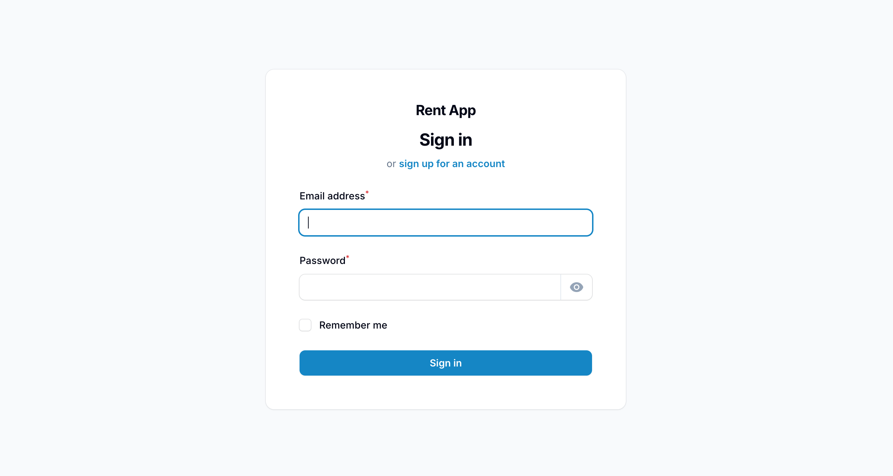
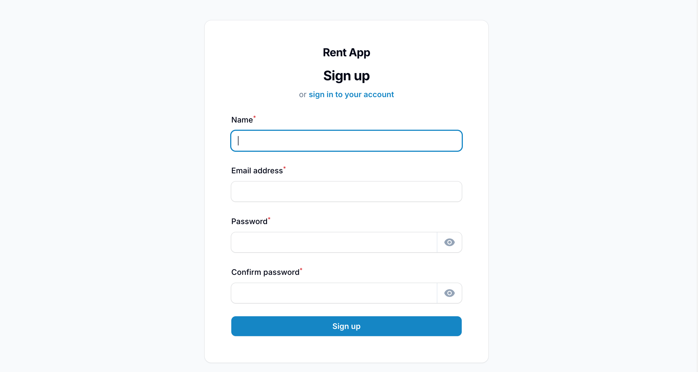
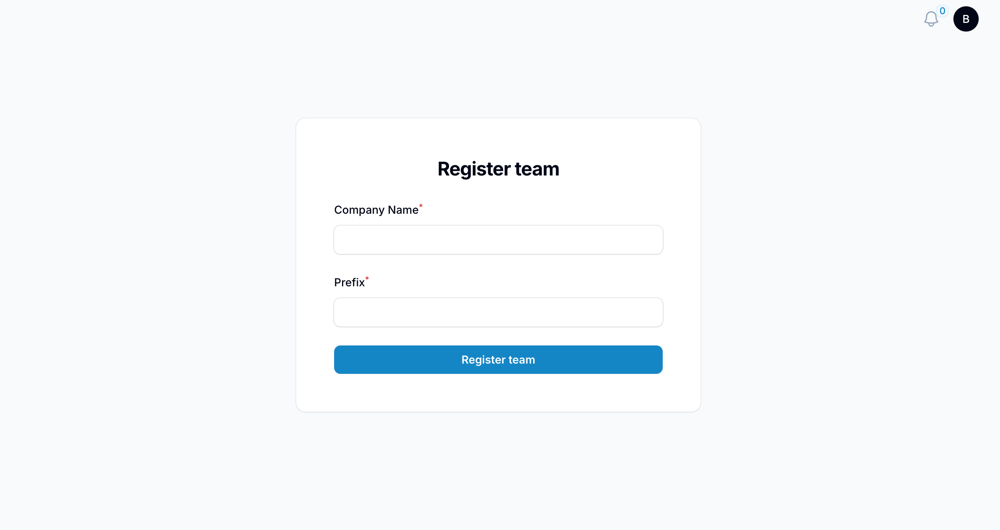
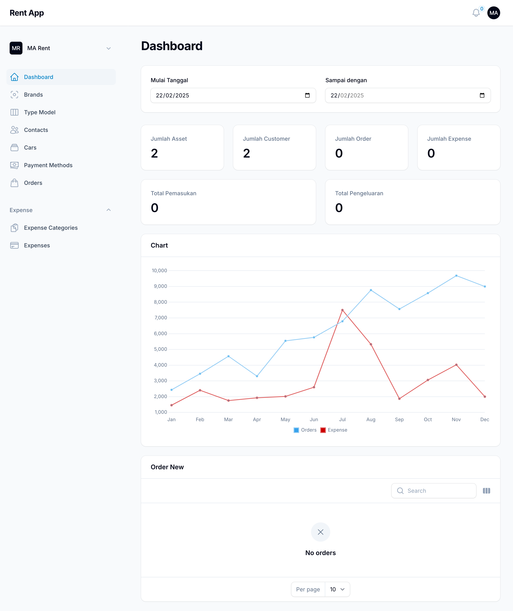
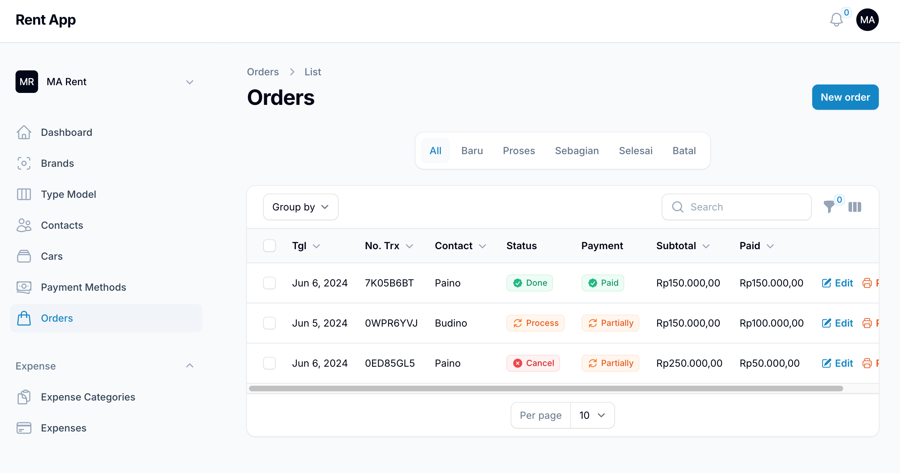
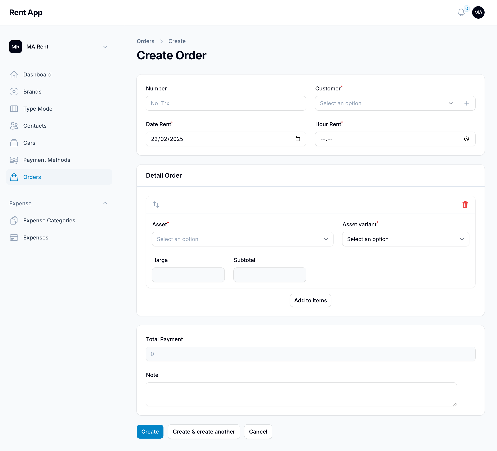

# Rent App Using Filament

Car rental web application using PHP with Laravel and Filament.

## Tech Stack

- [](https://laravel.com)
- [![Filament](https://img.shields.io/badge/Filament_3.2.124-F2911B?&logo=data:image/png;base64,iVBORw0KGgoAAAANSUhEUgAAACAAAAAgCAMAAABEpIrGAAAAIGNIUk0AAHomAACAhAAA+gAAAIDoAAB1MAAA6mAAADqYAAAXcJy6UTwAAAMAUExURQAAAP63Xf/Eef/Eef/Eef/EeP/Ddv/Eef+7aP65Yv/DeP/DeP/DeP/Dd/63Xf/Cdv/Cdv/Cdf/Cdf/Cdf/Bc//Acv/AcP++bf6+bP69av68aP67Zf65Yv64X/62XP61WP6zVv2yU/2yU/2wTv2xUf2wUP2wTv2wTv2wUP2wTv2wT/2vTf2vTP2uTP2uTP2uTP2uTP2vTP/Eef/DeP/Cdv/Cdf/Edv/Bc/7Cc+uzbcqcYrGKWr+TXNWiY/G3buawa9GfYfe7b//AcqOAVFJHOTYzMC8uLTEwLzg1MXBcQklANoNqSv/AcItvSykpKiwsK/2+cOGrZ/+/b7mOWCcoKKeBUf/EcTcyLP++bf6+bf+/bfe5a2RSOyQlJScnJoJmRKN+UJFySm5ZPtmkYP/CcPO2av6+bP++bJ96Tf/AbPi5avu8a11MN9ymYf69a/+9a7OJUiIiIkA3LeSrYve4aP68af67aPa2ZYhpQx8fH1tJM+6xZPq5aP+9aMyZV1dHMVNEMDQuJjIsJVFCL3lePPOzZM6aWP++af67Zv+9Zpp1RhoaGxwcHBcYGW1UNu+xYSIfHZZxQ/+6Zf65YhQVFumqWqR7Rz4zI+ytXfq2YHZaN049KBgXF2hQMtSbVP+7Y5NtPR4cGiwnH0k6KN6jWf+6Yn1fOFhELGBKLv24Yf+4YPazXlI+JREREmtRL4lmOf63X/+4XuKkVjEnHBMTERAQEIJgNs2VTf63XcOOShsYFLCBRNyfUiwjFvKtV/+2XJtxPA4ODSIcFdaaTP+3XH1cMuemVP61Wm5RLAkJCTwsGO2qVUw5IWBHJ9mcTv61WUUzHAYHCPyzWP+3Wd2dTQwKCZNqNv60V/+2VyYcEIxkMeGgTv6zVreCPwUFBf2zVs6SR4BcLRwVDGdKJfOsUf2yVP+1VQICAtiZSP6yU/ivUlE6HVpAH/CpT/2xUWBEIP+zU+CdSSIYDMaLQeqkTPuvUMGHPqd1Nf2wUKx4N7qCPP+yUv+zUf6xUP2wTv2vTZ+o92UAAAAydFJOUwANZcf098ttERig+akeCp6pX/dtvOr19PT09PX09PT09PTouMZY8/ZmlaCeWOr09b1ewbJCIQAAAAd0SU1FB+gLGgc7ErTzPVAAAALvSURBVDjLfdN5QIthHMDxX47kCiFHulwJubPoUGgqWY5STRNiOZuozShCWNairUSluUbS1FRyTaYci5BkySrSTI4hpSHH8757wx/y+eN5v8/v/b1/vgCg1659hwn/0FG/kwEgnbt0nNiGrt26Axj2mPQfPQ2gl5HtH5MxROEPo97Qh9TK1m7KVHt7B0cnO5LdtKnOLrbYUB/6TieQXGbMdCWTZ7m5O5HsPVzdZruQ0NQYjD0JLnPIFC+E4j53ngcqN0d8DMbzdTwXkCkUijfF29tnoYMXSl9HT2wO/fww/tRFATTvxb6BS5YuC1ru7Euj0QJWUP39/f2gP51OD6bTqUFouHglfRV19ZrgNT5r1wauo9IxMCAEYTBWraeFhm7YGMxgMNCVHhYWEhyCg4HhCJMVtokdyt68hcVioWsEKyIynAADmeHMyK3boraz2ewdUVE7o1mRu6K37d6Dxhwmk8kBEw6HE7OXy43FcLm8OE7Mvs3741kxHB0w4fP5grgELoaHxMfwEw8kxcYd5OvAIIFAcCg+OSWVx9t/ODk5OU0oPBJ79NjxE0IBDl8QiIQnE1ITkg6KRCJ0STuVmp52WkAsmGZgzmSKE8Tph/BOPJuUKs4SZeiAaTYiOZcjzs3LysA7MUWccz5fkq0DZhcQycVLeXm5lyV4XzkizT17FW8EzAoQyTWZTHa9UIJ10Q1ZrjTzZlGBDpjfwtyWy+TFdwrwzr8rK7l3qxWY30euPiiVl5Y8xLLsUaa0XP647D4BLBQKRcWjJ2ihskyB9dMHpdLKwgoFASyUSmVFVXl1dXlVRU1NjVLx7Hmt/EWdQqmswYGlSqV6WamuVte+eomy/vUbde2Tt++UKgIMRofmvVqtLn5Xj/LDx4aGT411ra9VljBEo9E0fW5ubv6sRaWpb/zytelbvabVUBg2XKvVtmC0uO8tLRrtb1YjwNBa+6NtI/UADKyH/2yD1ajO2O9tOHqIzZi/jCVOm3Hj0fe/AAQKJvDhfTdrAAAAJXRFWHRkYXRlOmNyZWF0ZQAyMDI0LTExLTI2VDA3OjU5OjE4KzAwOjAwamF45gAAACV0RVh0ZGF0ZTptb2RpZnkAMjAyNC0xMS0yNlQwNzo1OToxOCswMDowMBs8wFoAAAAodEVYdGRhdGU6dGltZXN0YW1wADIwMjQtMTEtMjZUMDc6NTk6MTgrMDA6MDBMKeGFAAAAAElFTkSuQmCC&labelColor=white "Filament")](https://filamentphp.com)

## Requirement

- [](https://php.net)
- [](https://getcomposer.org)
- [](https://www.postgresql.org)


## Installation

To get started using this app, simply paste this command into your terminal:
```bash
git clone https://github.com/mhdprojects/rent-filemant.git
composer install
npm install
cp .env.example .env
php artisan key:generate
```

## Database Configuration

- Create a database.
- Update the `.env` file in the Laravel project with your database credentials.
- Run migration using this command below:
```bash
php artisan migrate
```

## Run Application

To run this application:
```bash
php artisan serve
```

## Demo Aplication







## Author

- Mahmud Afrianto (https://afrimhd.my.id)
